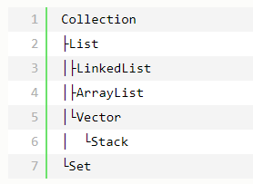

# 集合基础概要

- Java中Collection和Collections的区别  
  其中java.util.Collection是一个集合接口。  
  (1) 它提供了对集合对象进行基本操作的通用接口方法。  
  (2) Collection接口在Java类库中有很多具体的实现。  
  (3) Collection接口的意义是为各种具体的集合提供最大化的统一操作方式。  

  其中java.util.Collections是一个包装类。  
  (1) 它包含了有各种有关集合操作的静态多态方法。  
  (2) 此类不能实例化，就像一个工具类，服务于Java的Collection框架。  

